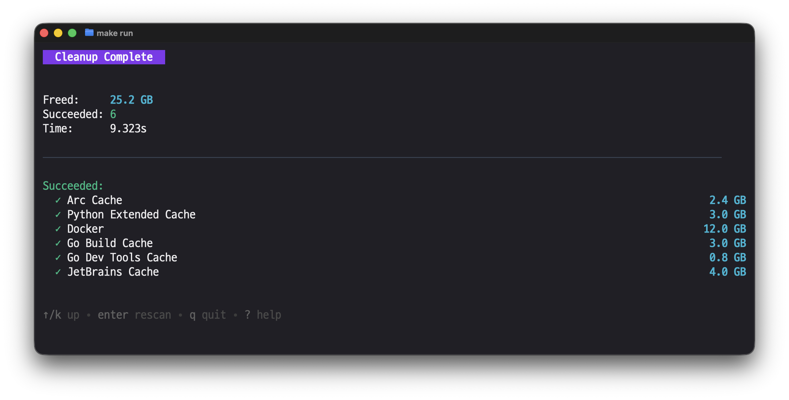

<div align="center">
  <h1>mac-cleanup-go</h1>
  <p>Preview-first TUI for cleaning macOS caches, logs, and temporary files.</p>
</div>

<p align="center">
  <a href="https://github.com/2ykwang/mac-cleanup-go/releases"></a>
  <a href="https://goreportcard.com/report/github.com/2ykwang/mac-cleanup-go"></a>
  <a href="https://github.com/2ykwang/mac-cleanup-go/actions/workflows/test.yml"></a>
  <a href="https://codecov.io/gh/2ykwang/mac-cleanup-go"></a>
  <a href="https://golangci-lint.run/"></a>
</p>

<p align="center">
  <a href="README.md">English</a> | <a href="assets/README_KO.md">한국어</a>
</p>

## Overview

- Select items that take up space and delete them yourself.
- By default, items go to Trash; only the Trash category empties it permanently.
- Risky categories are unselected by default; even when selected, items are auto-excluded. (Include them in Preview to delete.)
- Manual categories show guides only.
- Scope: caches/logs/temp and selected app data (no system optimization or uninstaller).




## Quick Start

**1) Install**

```bash
brew install mac-cleanup-go
```

**2) Optional: Full Disk Access (needed for Trash/restricted locations)**
System Settings -> Privacy & Security -> Full Disk Access -> add Terminal

**3) Run**

```bash
mac-cleanup
```

Tip: Use Enter to preview, then y to proceed with deletion.

**4) Help**
Press ? to see key bindings.


## How it works & safety

- Scans known cache/log/temp paths across apps and tools in parallel.
- Lets you preview items and exclude what you want to keep.
- By default, items go to Trash; only the Trash category empties it permanently.
- Labels targets by impact level (safe, moderate, risky, manual); manual categories show guides only.
- Risky categories are unselected by default, and items stay auto-excluded unless included in Preview.
- SIP-protected paths are excluded from scan/cleanup.
- Built-in scans for Homebrew, Docker, and old downloads (brew/docker output or last-modified time filtering).

## Impact levels

- safe: auto-regenerated caches/logs.
- moderate: may require re-download or re-login.
- risky: user data possible; items start excluded.
- manual: no automatic deletion; shows an app guide only.

## Targets (as of v1.3.6)

- Total targets: 107.
- Groups: System 7, Browsers 10, Development 35, Applications 52, Storage 3.
- Cleanup methods: trash 101, permanent 1, builtin 3, manual 2.
- Builtins: homebrew, docker, old-downloads (built-in scanners using brew/docker output or last-modified time filtering).
- Manual: telegram, kakaotalk (no automatic deletion; surfaces large data like chat caches).
- Counts are release-based and may change over time.

## Usage notes

- Supported: macOS (arm64, amd64).
- Full Disk Access helps scan/clean restricted locations.
- Version check: `mac-cleanup --version`.
- Update: `brew upgrade mac-cleanup-go` or `mac-cleanup --update`.
- Uninstall: `brew uninstall mac-cleanup-go`.

## Manual install

- If Homebrew isn't available, download the tar.gz from GitHub Releases and run the `mac-cleanup` binary.

## CLI flags

- `--version`, `-v`: print version
- `--update`: update via Homebrew
- `--debug`: save debug log (`~/.config/mac-cleanup-go/debug.log`)

## Config file

- User preferences (excluded paths, etc.) are stored at `~/.config/mac-cleanup-go/config.yaml`.

<details>
<summary><strong>Key bindings</strong></summary>

List view:

- `Up`/`Down` or `k`/`j`: move
- `Space`: select category
- `a`: select all, `d`: deselect all
- `Enter` or `p`: preview selection
- `?`: help, `q`: quit

Preview view:

- `Up`/`Down` or `k`/`j`: move
- `h`/`l`: previous/next category
- `Space`: toggle exclude
- `Enter`: drill into directory
- `/`: search, `s`: sort, `o`: open in Finder
- `a`: include all, `d`: exclude all
- `y`: delete (confirm), `esc`: back

Confirm view:

- `y` or `Enter`: confirm
- `n` or `esc`: cancel

</details>

## Alternatives

- [mac-cleanup-py](https://github.com/mac-cleanup/mac-cleanup-py) - Python cleanup script for macOS
- [Mole](https://github.com/tw93/Mole) - Deep clean and optimize your Mac

## License

MIT
