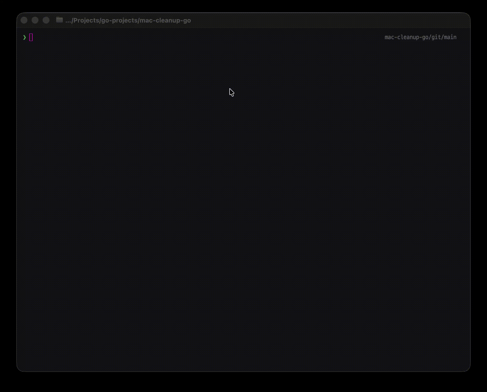

# mac-cleanup-go

[](https://github.com/2ykwang/mac-cleanup-go/releases)
[](https://goreportcard.com/report/github.com/2ykwang/mac-cleanup-go)
[](https://github.com/2ykwang/mac-cleanup-go/actions/workflows/test.yml)
[](https://golangci-lint.run/)

Interactive TUI for cleaning macOS caches, logs, and temporary files.



## Features

- **65+ cleanup targets** - System caches, browsers, dev tools, apps
- **Safety levels** - Each item labeled as Safe / Moderate / Risky
- **File-level control** - Preview and exclude individual files before deletion

## How It Works

```
┌─────────┐    ┌─────────┐    ┌─────────┐    ┌─────────┐
│  Scan   │───▶│  List   │───▶│ Preview │───▶│  Clean  │
└─────────┘    └─────────┘    └─────────┘    └─────────┘
 Detect all     Sort by size   File-level     Move to
 targets        + select       exclusion      Trash
```

Each item is labeled by deletion risk

- Safe: Auto-regenerated (browser cache, build artifacts)
- Moderate: Regenerable but costly (re-index, rebuild, re-login)
- Risky: May contain important data (backups, downloads)

Moved to Trash by default. Some use native commands (Docker, Homebrew), others guide manual deletion.

## Installation

```bash
# Homebrew
brew tap 2ykwang/mac-cleanup-go
brew install mac-cleanup-go

# Go install
go install github.com/2ykwang/mac-cleanup-go@latest
```

Or build from source:

```bash
git clone https://github.com/2ykwang/mac-cleanup-go.git
cd mac-cleanup-go && make build
./bin/mac-cleanup
```

## Usage

```bash
mac-cleanup          # Run the TUI
mac-cleanup -v       # Show version
```

> **Tip**: Grant Full Disk Access to your terminal for complete cleanup access.

## Inspired by

[mac-cleanup-py](https://github.com/mac-cleanup/mac-cleanup-py)

## License

MIT
